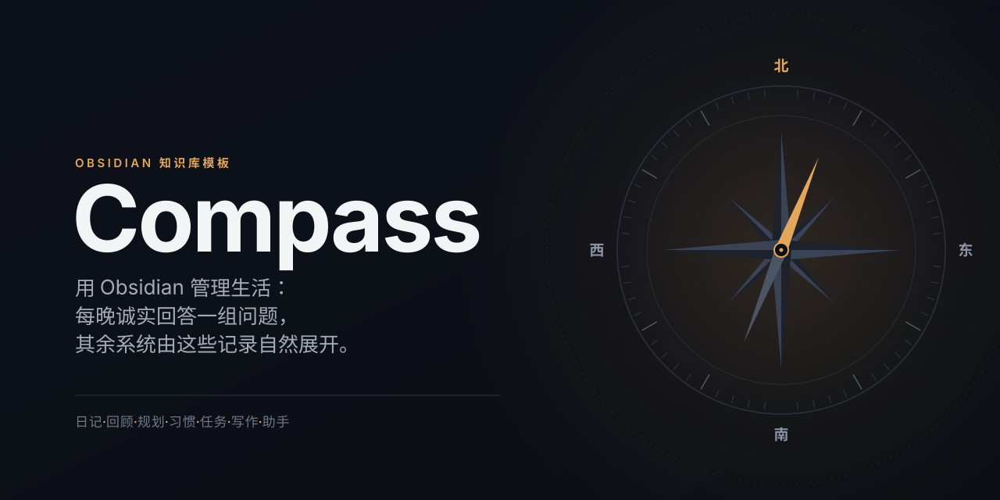

<p align="center"></p>

# Life OS 中文版

*用 Obsidian 管理生活：每天诚实回答一组问题，其余系统由这些记录自然展开。*

Compass 是一个完整的 Obsidian Vault 模板，包含每日复盘、季度个人回顾、多尺度规划、习惯追踪、每日阅读、任务管理、写作看板和 DataviewJS 仪表盘。Life OS 应用位于这些流程之上，AI 助手会读取 `AGENTS.md`，并按批准规则运行提示词库。所有内容仍然使用普通 Markdown 与属性保存。

这是 [AgriciDaniel/compass](https://github.com/AgriciDaniel/compass) 的非官方简体中文汉化分支。用户可见的目录、笔记名和界面文字已经汉化；属性键、查询语法、插件 ID 和命令 ID 等机器标识保持原值，以便继续同步上游并保证功能兼容。具体来源、汉化基准与再分发要求见 [`汉化来源与许可.md`](汉化来源与许可.md)。

**状态：中文候选版本，等待真实 Obsidian 验收。** 需要 Obsidian 1.13.1 或更高版本。核心仪表盘可在移动端使用；Agent Client 和本地 API 桥接仅支持桌面端。

## 快速开始

1. 下载 Release 压缩包，或克隆本仓库。仓库根目录就是 Vault。
2. 在 Obsidian 中选择“将文件夹作为仓库打开”。
3. Obsidian 询问受限模式时，选择关闭受限模式，然后执行“重新加载应用，不保存”。
4. 打开 `00 仪表盘/初始设置.md`，按检查清单完成设置。
5. 晚上按 `Ctrl/Cmd+Shift+D` 打开当天笔记，再按 `Ctrl/Cmd+Shift+Q` 回答每日问题。

带有 `example` 标签的笔记是演示数据，用来让仪表盘首次打开时就有内容。开始记录真实数据后，可按“初始设置”清单删除这些示例。

## 文件夹说明

```text
00 仪表盘/   设置、总览、习惯、每日问题、任务、项目、看板和助手
01 日志/      日、周、季度笔记
02 季度回顾/     季度个人回顾
03 规划/     人生主题、核心价值观和理想一周
04 项目/     项目笔记与项目看板
05 人物/       人物笔记、待讨论事项与相关任务
06 写作/      新闻通讯、视频、文章和课程写作看板
07 资料库/      书籍笔记与可嵌入的引用
08 任务/        任务总表
09 阅读/      阅读计划、章节、经文、学习笔记和主题
提示词/         16 个可重复运行的 AI 工作提示词
模板/       Templater 模板
系统/            总配置、仪表盘脚本和版本信息
使用指南/           中文使用指南
知识库/, 收件箱/    可选知识层
scripts/         构建、检查和内容生成脚本
汉化记录/    汉化台账、路径对应、统一术语和上游同步状态
```

`系统/Compass 配置.md` 是唯一的主要配置文件，保存每日问题、习惯、生命之轮领域、文件夹、属性前缀和生日。仪表盘通过 `dq_*`、`habit_*` 和 `wheel_*` 前缀发现数据，因此不要改动已有属性键。

## 七个核心流程

| # | 流程 | 主要位置 | 指南 |
| --- | --- | --- | --- |
| 1 | 日记与每日问题 | `01 日志/每日`、`模板/每日笔记.md` | `使用指南/03 工作流 - 日记与每日问题.md` |
| 2 | 季度个人回顾 | `02 季度回顾`、`模板/季度个人回顾.md` | `使用指南/04 工作流 - 季度个人回顾.md` |
| 3 | 多尺度规划 | `01 日志`、`03 规划` | `使用指南/05 工作流 - 多尺度规划.md` |
| 4 | 习惯追踪 | 每日笔记中的 `habit_*` 属性 | `使用指南/06 工作流 - 习惯追踪.md` |
| 5 | 每日阅读 | `09 阅读` | `使用指南/07 工作流 - 每日阅读.md` |
| 6 | 任务管理 | `08 任务`、`04 项目`、`05 人物` | `使用指南/08 工作流 - 任务管理.md` |
| 7 | 写作 | `06 写作` 中的看板 | `使用指南/09 工作流 - 写作.md` |

推荐先只使用每日笔记，坚持 30 天后再加入下一层。完整入口是 `使用指南/00 从这里开始.md`。

## 内置插件

Vault 内包含以下社区插件，并保留各自的许可证：Dataview、Templater、Periodic Notes、QuickAdd、Tasks、Kanban、Omnisearch、Local REST API、Agent Client 和 SEO。第一方 `life-os-app` 插件提供导航、快速记录和实时仪表盘。详情见 `使用指南/02 插件.md` 与 `THIRD_PARTY_NOTICES.md`。

## AI 助手

- `AGENTS.md` 是 AI 助手的统一规则，包含文件夹说明、属性约定和安全边界。
- `提示词/` 保存 16 个日常工作提示词，每个提示词都有风险级别和按钮。
- Agent Client 可在 Obsidian 侧边栏中运行 Claude Code、Codex、Gemini CLI 等本地代理。
- Local REST API 5.x 可在 `http://127.0.0.1:27123/mcp` 提供 MCP 服务。
- Vault 不附带任何密钥。密钥和会话文件不会进入构建产物。

## 构建与检查

```bash
python3 scripts/verify_release_safety.py
python3 scripts/build_template.py --out ../life-os-releases --name Compass-zh-CN --version 1.0.0 --zip
python3 scripts/verify_template.py ../life-os-releases/Compass-zh-CN
```

构建脚本只保留带 `example` 标签的演示笔记，重置插件运行状态，移除密钥和本机路径，然后检查链接、JavaScript 语法、插件设置、许可证和文件大小。

当前没有自动原地升级器。升级前应完整备份 Vault，把新版本解压到旁边，再逐项迁移个人内容和自定义配置。不要直接覆盖正在使用的 `.obsidian` 文件夹。

## 上游同步

本仓库建议保留两个远程地址：

- `origin`：自己的中文仓库 `bigbadasss/compass`
- `upstream`：英文原仓库 `AgriciDaniel/compass`

每次同步时，先把上游更新合并到单独分支，解决英文原文与中文译文的冲突，运行全部检查，再合并到中文主分支。这样可以持续跟进原版功能，同时保留中文内容。

具体对应关系记录在 `汉化记录/`。获取上游后运行 `python3 scripts/localization_report.py upstream/main`，即可列出发生变化的英文文件以及对应的中文目标路径。

## 致谢与许可证

原项目由 Daniel Agrici 创建，工作流参考 Mike Schmitz 的公开视频。每日问题来自 Marshall Goldsmith 与 Mark Reiter 的《Triggers》，多尺度规划参考 Cal Newport。详情见 `CREDITS.md`。

代码、模板、仪表盘、脚本和配置使用 MIT 许可证，见 `LICENSE`。`使用指南/` 中的说明文字使用 CC BY 4.0，见 `LICENSE-GUIDE.md`。第三方插件保留各自许可证，见 `THIRD_PARTY_NOTICES.md`。中文项目的完整来源与许可说明见 `汉化来源与许可.md`。
